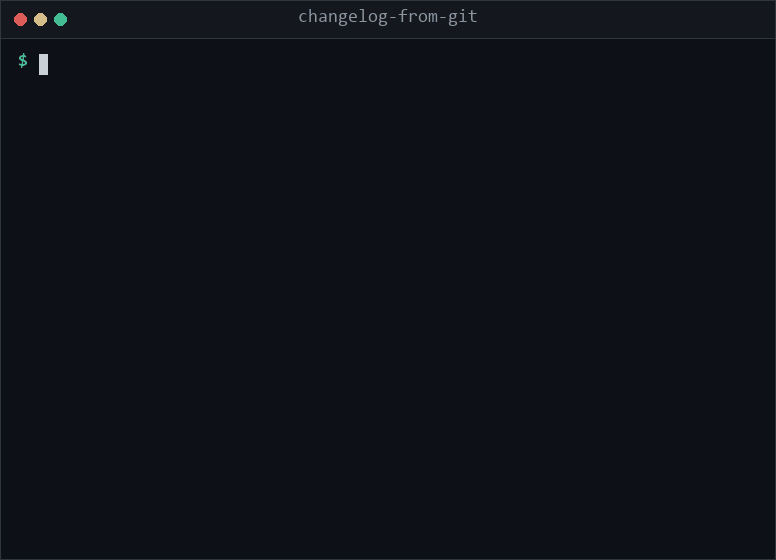

# changelog-from-git

**Turn conventional commits into a real CHANGELOG.md. One stdlib Python file, no config.**

<p align="center">
  
</p>

## Quickstart

```
curl -sO https://raw.githubusercontent.com/botaoishere/changelog-from-git/main/changelog_from_git.py
python changelog_from_git.py --unreleased
```

Python 3.8+. No dependencies. Copy it into your repo or keep it on your PATH.

Release day always ends the same way: someone scrolls `git log`, copies twelve subjects into a markdown file, forgets the breaking change, and ships. The existing generators want a Node toolchain, a config file, and an opinion about how you version. This is one script you drop in a repo, run once, and read the diff of.

## Usage

```
python changelog_from_git.py --unreleased --repo-url https://github.com/you/repo
```

Real output from a repo with four commits since the last tag:

```markdown
## [v0.2.0] - 2026-08-01

### :warning: Breaking changes

- drop python 2 support ([`d617574`](https://github.com/you/repo/commit/d6175743201e12a0299fc43bc6c8a5be40551d9c))

### Fixed

- handle repos with zero tags ([#12](https://github.com/you/repo/issues/12)) ([`5eed5f3`](https://github.com/you/repo/commit/5eed5f3c91bee35995c05bd32aebe90cc9d646b2))

### Performance

- stream git log instead of buffering ([`ac1fdef`](https://github.com/you/repo/commit/ac1fdef101cf805d026b27e883c3a568f6f1bdd3))

### Other

- random unstructured message ([`19cc09e`](https://github.com/you/repo/commit/19cc09e5081b3e4645699929a29e360a34d6450d))

_1 commit did not follow conventional commits. They are listed under Other, not dropped._
```

### Flags

| Flag | What it does |
| --- | --- |
| `--unreleased` | Everything since the newest tag. The default when no range is given. |
| `--from TAG` | Start of the range, exclusive. |
| `--to TAG` | End of the range, inclusive. Also becomes the release heading. |
| `--title TEXT` | Override the heading, for example a version you have not tagged yet. |
| `--repo-url URL` | Turns short hashes and `#123` into links. |
| `--in-place` | Prepends the new release to CHANGELOG.md and leaves older entries untouched. |
| `--file PATH` | Target for `--in-place`, defaults to `CHANGELOG.md`. |

### How commits map to sections

`feat` goes to Added. `fix` to Fixed. `refactor`, `style`, `build`, `ci`, `chore` to Changed. `remove` and `revert` to Removed. `perf` to Performance. `docs` and `test` to Docs. Anything else lands in Other.

A commit is breaking if the subject is `feat!:` or the body contains `BREAKING CHANGE`. Breaking items are pulled to the top of the release under a warning heading and are not repeated further down.

### Edge cases it actually handles

- **No tags at all.** The whole history becomes one Unreleased section instead of erroring.
- **Non conventional commits.** They go under Other and the footer tells you how many there were. Nothing is silently dropped, which is the failure mode that makes people distrust generated changelogs.
- **Existing CHANGELOG.md.** `--in-place` splices the new release in after the header and before the first old `##` heading. Run it twice and you get two releases, not a clobbered file.
- **Scopes.** `feat(parser): ...` renders as **parser:** followed by the subject.

## Why not standard-version or semantic-release

Those are good tools if you want the whole release pipeline. This is not that. It does one thing, and the tradeoff is deliberate:

- **No config file.** The section mapping is twelve lines at the top of the script. Edit it if you disagree.
- **No Node.** If your project is Go, Rust, Python or a pile of shell scripts, you should not need a package.json to write a changelog.
- **One file.** You can read the entire implementation in five minutes and you will know exactly what it did to your repo.
- **It does not tag, bump, or push.** Version bumping belongs to your release process, not to a changelog formatter.

## License

MIT
